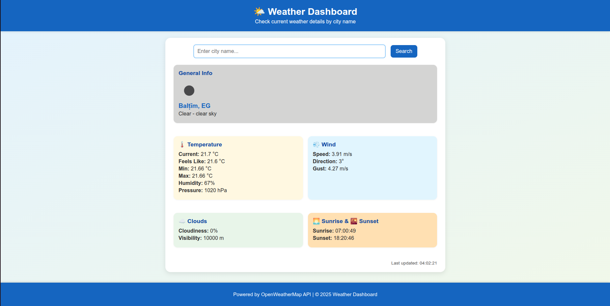
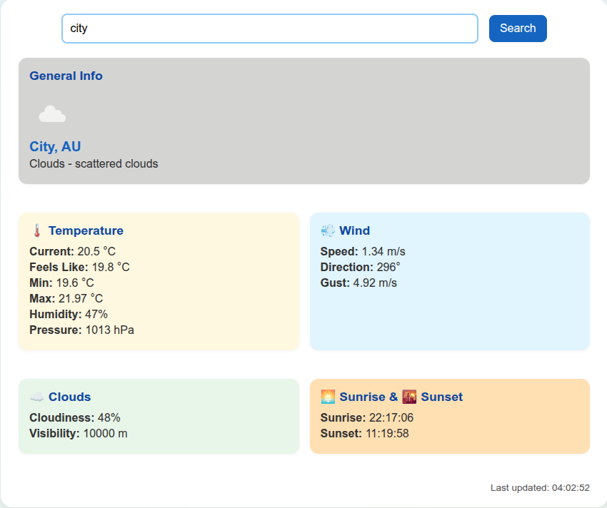

# Weather Dashboard Website

## Description
The Weather Dashboard Website is a responsive, user-friendly web application that provides real-time weather information for any location. The application automatically detects the user's location using the browser's geolocation API and fetches current weather data from the OpenWeatherMap API. Users can also manually input a city as a fallback. The interface presents detailed weather metrics, including temperature, humidity, wind speed, cloud coverage, and descriptive weather conditions, in a visually appealing and organized layout.

---

## Table of Contents
- [Project Structure](#project-structure)
- [Installation](#installation)
- [Usage](#usage)
- [Features](#features)
- [Configuration / Environment Variables](#configuration--environment-variables)
- [Screenshots / Demo](#screenshots--demo)
- [Technologies Used](#technologies-used)
- [GitHub repository](#github-repository)


---

## Project Structure
```text
backend/
├── main.py                 # FastAPI application entrypoint
├── core/
│   ├── cache.py            # In-process TTL caching utilities
│   ├── config.py           # Environment configuration and settings
│   ├── logger.py           # Structured logging setup
│   └── exception.py       # custom exception handling
├── api/
│   └── routes/
│       ├── weather_route.py      # Weather-related API routes (/api/weather)
│       └── health_route.py       # Health check endpoint (/api/health)
├── services/
│  └── weather.py  
├── models/
│  └── weather_service.py        # Weather service
|
├── constant_manager      # Constant manager
│  
static 
├── js/
│   └── weather.js      # Frontend JavaScript for geolocation, API calls, and UI updates
├── css/
│   └── style.css       # Stylesheet for the dashboard
templates/
    └── index.html          # Jinja2 HTML template for the frontend
```
---

## Installation
1. Navigate to project directory:
    ```bash
    cd vibe_coding_assessment/task1_weather_dashboard
    ```

2. Create a virtual environment using pip:
    ```bash
    python3.13 -m venv .venv
    ```
    Or using uv:
    ```bash
    uv venv --python 3.13 .venv
    ```

3. Activate the virtual environment:
    - Linux / macOS:
        ```bash
        source .venv/bin/activate
        ```
    - Windows (CMD):
        ```bash
        venv\Scripts\activate
        ```
    - Windows (PowerShell):
        ```bash
        venv\Scripts\Activate.ps1
        ```

4. Install dependencies:
    ```bash
    pip install -r requirements.txt
    ```
5. Set environment variable:

6. Run the server
    ```bash
    uvicorn backend.main:app --reload --port 7000
    ```

7. Open your browser to view the dashboard:
    - Frontend: http://http://127.0.0.1:7000/
    - Swagger API documentation: http://http://127.0.0.1:7000/api/docs#/

---
## Usage
- Upon loading the dashboard, the app will attempt to detect your location automatically.

- If geolocation fails or is denied, manually enter a city name in the input field.

- The dashboard displays:

    - Temperature (current, feels like, min/max)

    - Humidity and pressure

    - Wind speed, direction, and gusts

    - Cloud coverage and visibility

    - Sunrise and sunset times

    - Weather description and icon

- API endpoints for testing:

    - `POST /api/weather/city` — fetch weather by city name

    - `POST /api/weather/coords` — fetch weather by latitude/longitude

    - `GET /api/health` — health check endpoint

---
## Features
- Automatic user location detection using `browser geolocation`.

- Fallback manual city input if location detection fails.

- Fetch and display current weather data:

    - Temperature, feels like, min/max

    - Humidity, pressure, and visibility

    - Wind speed, direction, and gusts

    - Cloudiness and descriptive weather status

- Error handling for network, API failures, or geolocation issues.

- Responsive, visually appealing UI using Jinja2 templates and vanilla JavaScript.

- Last updated timestamp with caching to reduce API calls and handle rate limits gracefully.

---
## Configuration / Environment Variables

All environment variables are configured in config.py or a .env.example file:
- `WEATHER_API_KEY` (Required) - API key for OpenWeatherMap.
- `WEATHER_API_URL` - (Optional) - Base URL for weather API

---
## Screenshots / Demo
- Dashboard view:




- Weather details section:




---
## Technologies Used
- Frontend:

    - Jinja2 templates

    - HTML5, CSS3

    - Vanilla JavaScript (ES6)

- Backend:
    - Python 3.13

    - FastAPI

    - Uvicorn ASGI server

    - Pydantic for request/response validation

    - httpx.AsyncClient for async API calls

    - In-process caching (TTL cache)

    - openweathermap for fetching weather data

- Other Tools:

    - Virtual environment (venv or uv)

    - Structured logging

    - GIT for repository management

---

## GitHub repository

- Github repo link: https://github.com/ola172/task1_weather_dashboard.git

---
